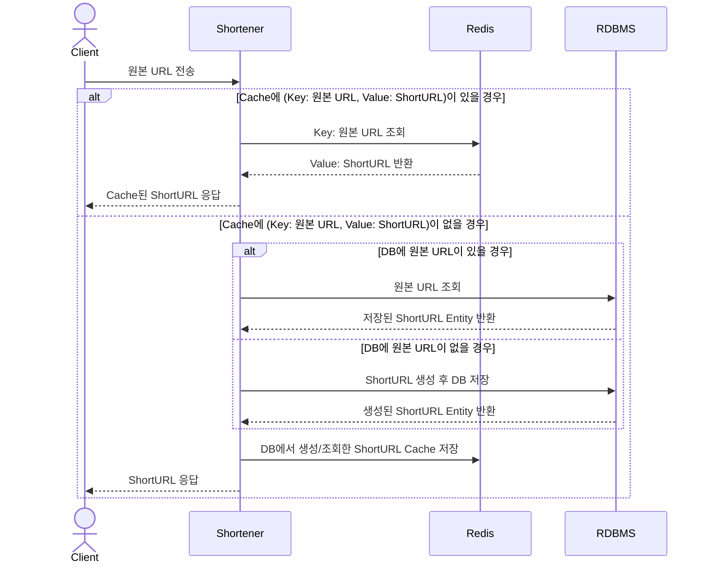
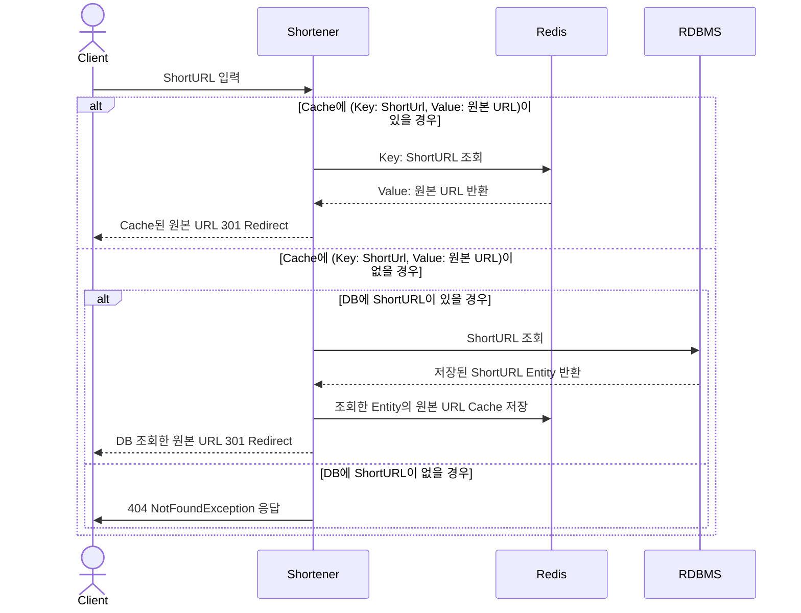

# URL Shortener (URL 단축기)
URL Shortener는 긴 URL을 짧은 링크로 변환하고, 짧은 링크를 원래의 긴 URL로 리다이렉트하는 기능을 제공합니다.

사용 기술
- Kotlin, Gradle, SpringBoot, JUnit5, Mockk, MySQL, Redis, JPA, QueryDLS

## 주요 기능
1. URL 단축: 주어진 원본 URL을 짧은 링크로 변환합니다.
2. URL 리다이렉트: 단축된 URL을 원본 URL로 리다이렉트합니다.

## 설계 및 아키텍처
### 1. URL 단축
#### Sequence Diagram

- URL 단축 길이 8자 이내로 생성 
- 동일한 URL 단축에 대한 요청은 동일한 ShortURL로 응답
- URL 단축 시 Cache 이용

### 2. URL 리다이렉트
#### Sequence Diagram

- 단축 URL을 입력받으면 원본 URL로 리다이렉트
- URL 리다이렉트 시 Cache 이용
