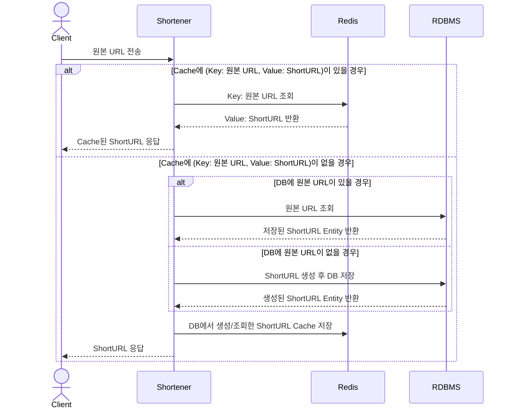
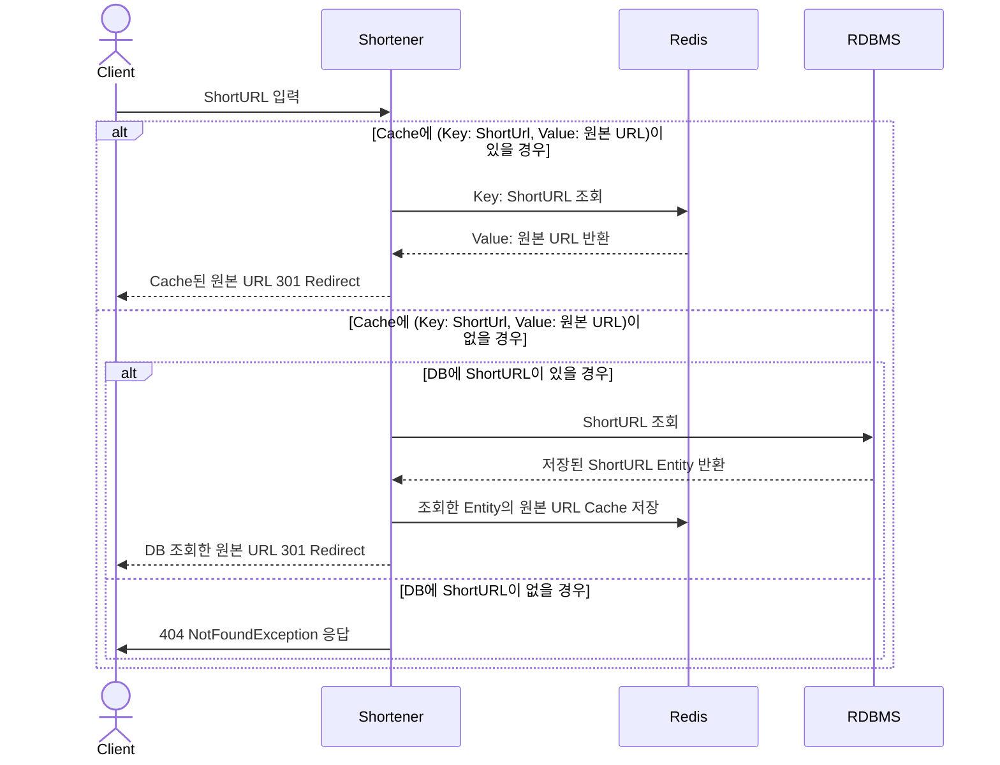

# URL Shortener (URL 단축기)
URL Shortener는 긴 URL을 짧은 링크로 변환하고, 짧은 링크를 원래의 긴 URL로 리다이렉트하는 기능을 제공한다.

#### 사용 기술
- Kotlin, Gradle, SpringBoot, JUnit5, Mockk, MySQL, Redis, JPA, QueryDLS

## 주요 기능
1. URL 단축: 주어진 원본 URL을 짧은 링크로 변환
2. URL 리다이렉트: 단축된 URL을 원본 URL로 리다이렉트

## 아키텍처 및 설계
### 1. URL 단축
#### 1.1 URL 단축 방법
- BASE62 알고리즘을 이용, `[0-9a-zA-Z]` 패턴의 8자 이내의 단축 URL 생성
- 가능한 경우의 수: 8자의 BASE62 단축 URL로는 최대 약 `218,340,105,584,896`개의 고유한 URL 생성 가능
#### 1.2 BASE62 생성 Key 전략
- MySQL Auto Increment: DB Connection 리소스 최소화 고려의 사유로 선택하지 않음
- Snowflake Id: BASE62 생성 시 8자 초과, Application에서 구현 시 Snowflake 용례에 부합하지 않아 선택하지 않음
- Timestamp + Sequential Number 조합: 최대 2099년까지 사용 가능. 초당 최대 9999개의 URL 단축 가능. 해당 방식 직접 고안하여 선택 
#### 1.3 단축 URL 재사용
- 동일한 원본 URL 요청에 대해 기존의 단축 URL을 반환
#### 1.4 성능 최적화
- Redis Cache를 활용. 동일한 URL 단축 요청에 대해 Cache된 단축 URL 반환
- Cache Miss 발생 시 DB 조회 후 Cache 갱신
- Read Through, Write Through Cache 전략 사용
- `단축 URL 재사용` 시 원본 URL을 SHA-256 알고리즘으로 해시. DB에서 해시 한 원본 URL 값에 Index 지정. 조회 성능 향상

#### Sequence Diagram

### 2. URL 리다이렉트
#### 2.1 리다이렉트 동작
- 단축 URL 요청 시, 해당하는 원본 URL을 조회하고 `301 Moved Permanently` Status Code로 리다이렉트
#### 2.2 성능 최적화
- Redis Cache를 활용. 동일한 단축 URL 요청에 대해 Cache된 원본 URL 반환
- Cache Miss 발생 시 DB 조회 후 Cache 갱신
- Read Through, Write Through Cache 전략 사용

#### Sequence Diagram

