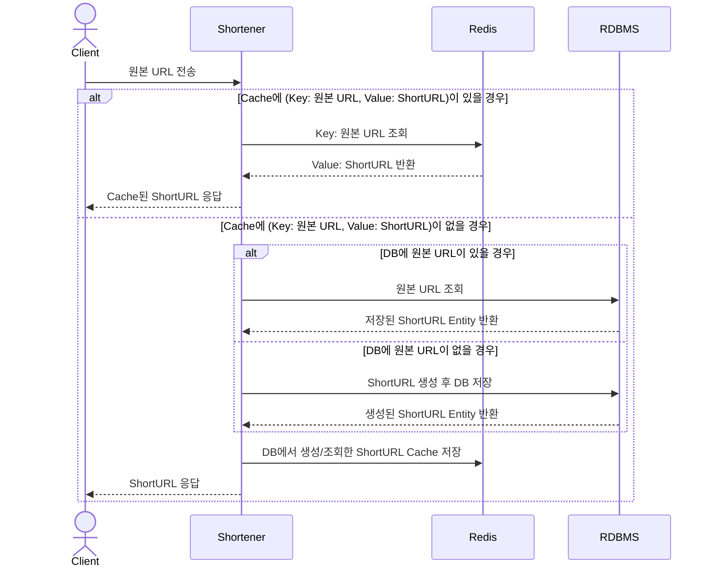
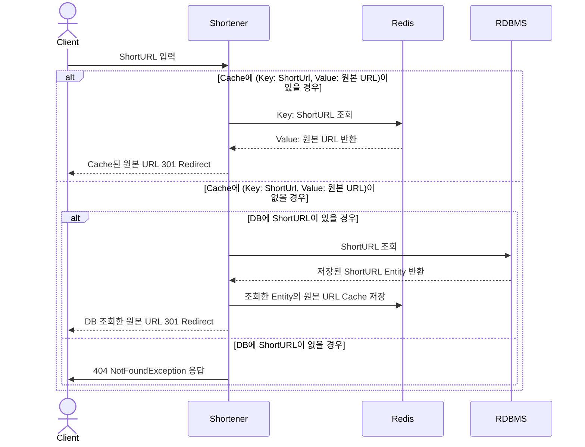

# URL Shortener (URL 단축기)
URL Shortener는 긴 URL을 짧은 링크로 변환하고, 짧은 링크를 원래의 긴 URL로 리다이렉트하는 기능을 제공합니다.

사용 기술
- Kotlin, Gradle, SpringBoot, JUnit5, Mockk, MySQL, Redis, JPA, QueryDLS

## 주요 기능
1. URL 단축: 주어진 원본 URL을 짧은 링크로 변환합니다.
2. URL 리다이렉트: 단축된 URL을 원본 URL로 리다이렉트합니다.

## 설계 및 아키텍처
### 1. URL 단축
- URL 단축 길이 8자 이내로 생성
  - 알고리즘 직접 구현  
    BASE62 알고리즘을 이용하여 `[0-9a-zA-Z]` 유형의 단축 URL이 생성되도록 합니다.
  - BASE62 생성 Key 전략  
    BASE62 알고리즘을 이용하여 단축 URL 생성 시 3가지 방법을 검토했습니다.
    - MySQL Auto Increment  
      ShortUrl Entity에 MySQL의 Auto Increment 전략을 이용하여 PK를 지정합니다. 그리고 해당 PK로 BASE62의 생성 Key로 사용하는 방법을 검토했습니다.  
      해당 방법은 DB에 먼저 Insert를 한 후 해당 값을 조회하여 사용해야 한다는 점. 그리고 생성한 ShortURL을 업데이트 해야한다는 점을 생각하여 선택하지 않았습니다.  
      DB Connection을 절약하여 URL 단축 시 리소스를 최소화 할 수 있는 방법을 고려했습니다.  
       
    - Snowflake Id  
      Snowflake 는 Twitter에서 만든 분산 환경에서 사용 가능한 Unique Id 생성 방식입니다.  
      해당 방식을 선택하지 않은 이유는 다음과 같습니다.
      - BASE62 생성 키로 사용하기에 큰 값  
        2023-10-03 17:04:03.500 기준 Snowflake ID 생성 값은 `435457421885459952`입니다.  
        해당 값을 BASE62로 나타내면 `gKYwGutWow`가 됩니다. 10자의 단축 URL로 앞서 지정한 기준에 부합하지 않게 됩니다.
        트래픽이 더욱 증가하여 단축 URL의 길이 제한을 조정할 경우 검토할 수 있다고 생각합니다.  
        추가로 해당 Application에서 Snowflake Id를 생성하여 사용하는 것은 용례에 맞지 않는다고 생각합니다.  
         
    - Timestamp + Sequential Number `선택`  
      10자의 Timestamp + (0001 ~ 9999)의 규칙을 이용하여 BASE62 생성 Key로 사용했습니다.  
      Sequential Number는 1초마다 값이 갱신 되도록 하였고, 1초에 최대 9999개의 URL 단축을 할 수 있도록 했습니다.  
      2099-12-31 23:59:59 기준 Timestamp는 `4102444799`입니다.   
      `4102444799 + 9999` 값을 BASE62로 나타내면 `LoQBVAdR`가 됩니다. 8자의 단축 URL로 앞서 지정한 기준에 부합하게 됩니다.  
      이론상 최소 2099년 12월 31일 23시 59분 59초 까지 사용할 수 있다는 점,  
      하루 1억건의 쓰기 요청을 수용한다고 가정할 경우 초당 쓰기 연산량은 1160으로 Sequential Number에서 수용 가능하다는 점을 이루어 해당 방법을 선택했습니다.  
       
- 동일한 URL 단축에 대한 요청은 동일한 ShortURL로 응답
  - URL 단축 이력이 있는 원본 URL이 인입 될 경우, 기존의 단축 URL을 응답하도록 했습니다.  
  - shorten_url Table의 originUrl Column 속성은 TEXT로 지정했습니다.  
    조회 성능 개선을 위해 예상하지 못하는 긴 원본 URL은 별도로 수집하고, 이를 SHA-256 Hash를 이용하여 단축했습니다.  
    hashedOriginUrl Column에 index를 지정하여 조회 성능을 향상했습니다.  
    Redis Key로 원본 URL을 사용할 경우 메모리 사용량을 절약하기 위해 hashedOriginUrl을 Redis Key로 대체하였습니다.  
     
- URL 단축 시 Cache 이용
  - Redis Cache를 이용하고, Read Through, Write Through Cache 전략을 사용했습니다.  
  - 동일한 URL 단축 요청이 인입 될 경우 Cache에 해당 값이 있을 경우 Cache 된 단축 URL을 반환하여 응답 성능을 개선했습니다.
  - Cache Miss가 발생할 경우 DB 조회/생성 후 Cache 갱신을 하도록 했습니다. 해당 방법으로 CacheEvict를 방지하여 데이터 동기화를 하도록 했습니다.

#### Sequence Diagram

### 2. URL 리다이렉트
- 단축 URL을 입력받으면 원본 URL로 리다이렉트
  - ShortURL 요청이 인입 될 경우 이에 해당하는 원본 URL을 조회한 후 `301 Moved Permanently` Status Code를 이용하여 리다이렉트 하도록 했습니다.
- URL 리다이렉트 시 Cache 이용
  - Redis Cache를 이용하고, Read Through, Write Through Cache 전략을 사용했습니다.  
    동일한 단축 URL 요청이 인입 될 경우 Cache에 해당 값에 해당하는 원본 URL이 있으면 이를 반환하여 응답 성능을 개선했습니다.
  - Cache Miss가 발생할 경우 DB에서 원본 URL 조회 후 Cache 갱신을 하도록 했습니다. 그 후 리다이렉트 응답을 하도록 했습니다.
#### Sequence Diagram

